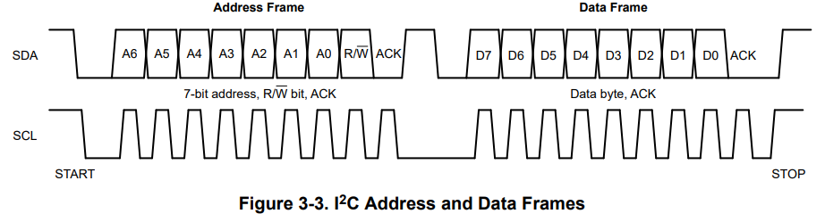

# I2C

## Features
1. Speed: 100kbps to 5Mbps
2. Ports: VDD, GND, __SDA__, __SCL__

## Protocol

__Start__: The master device first pulls the SDA low and then pulls the SCL low.

__Transit__: The I²C protocol operates by structuring communication into frames, with each interaction beginning when the controller device initiates a START condition and ending with a STOP condition. The process starts with the controller sending the target device's 7-bit address followed by a Read/Write (R/W) bit to indicate whether the data will be read from or written to the target device. Each frame contains an acknowledgment bit (ACK) to confirm that the previous byte was received successfully. If a frame is intended to write data, the target device acknowledges receipt of the data byte; if it is a read operation, the controller acknowledges the received data from the target device. 

Communication concludes with a STOP condition, indicating the end of the transmission sequence. In the I²C protocol, each device on the bus has a unique 7-bit address, although certain addresses are reserved and discussed in another section of the documentation. This addressing scheme allows the controller to manage multiple devices on the same bus without contention, ensuring clear and organized data transfer between devices. Each data transaction is verified with an ACK from the receiving end, ensuring robust and error-checked communication throughout the process.

__End__: The master device first pulls the SCL back to HIGH and then resets the SDA.

## Related Interfaces

## Resources
1. [A Basic Guide to I2C](https://www.ti.com/lit/an/sbaa565/sbaa565.pdf?ts=1721739938821&ref_url=https%253A%252F%252Fwww.google.com%252F#:~:text=I2C%20is%20a%20two%2Dwire,and%20receive%20commands%20and%20data.)

