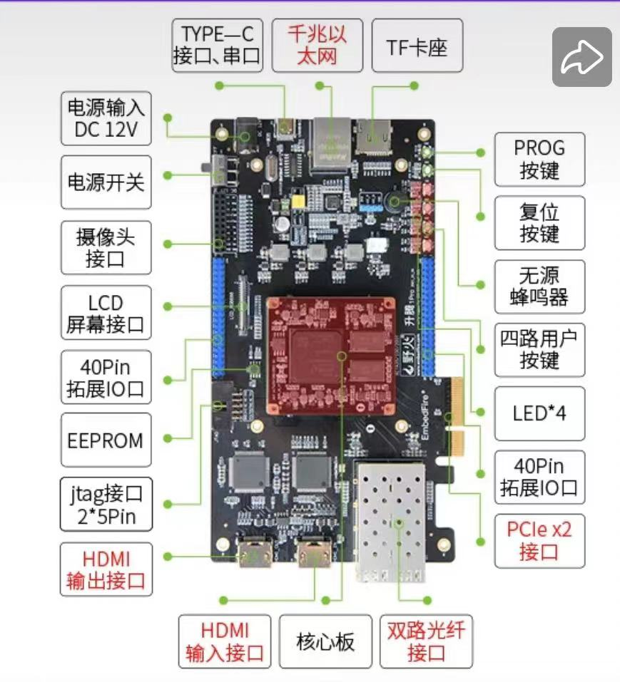

# Test blog

This is a reference guide to the suppoted markdown function by my converter

## Headers

# Header 1
## Header 2
### Header 3
#### Header 4
##### Header 5
###### Header 6

## Emphasis

*This text will be italic*
_This will also be italic_

**This text will be bold**
__This will also be bold__

You can combine them **_like this_**

## Lists

### Unordered

* Item 1
* Item 2
  * Item 2a
  * Item 2b

### Ordered

1. Item 1
2. Item 2
3. Item 3
   1. Item 3a
   2. Item 3b

## Links

[This is a link](http://www.example.com)

## Images //TODO



## code

`This is a single line of code`

```
This is a code block
```


